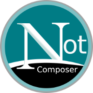

# Notscape Composer
A very small and naive static blog system for people like me who don't know how to program and don't want or can't use more complex CMS.

See how it looks online: http://supercaras.com.br/notscape-composer/

## Features

- No composer or generator. Just work out-of-the-box
- No SQL. Only PHP, CSS, a little JS and HTML
- Microdata schema with best SEO practices
- Full control over what is viewed and indexed by searchbots
- Very light, good for limited web host server
- Fast page load
- Update files only by ftp or cpanel drive
- Consistent display on any device

## Limitations
- No comments and trackback.
- No RSS/feed (you will need to use a newsletter or other external solution).
- Can be chaotic when you have many post and page files (but posts will be in date order).
- List of posts can be hard to navigate.
- The search system may fall or bring poor results.

### How does it work?

It is a very basic application of PHP code, which joins the parts of HTML code (header, footer and body) and fills in some variable fields like post title, keywords etc. Content files are properly delimited and can be easily edited, imported or exported. You will need free access by ftp or cpanel to edit and create files.

## INSTRUCTIONS

### Install
Just put the files on the server, set the 001.php, 003.php and assets/js/search.js files and that should work.

### Writing
Edit in your favorite code editor.
Use regular html elements.
Upload to your server via ftp or web drive in cpanel.

##### Date and time format

When creating a page/post it is important to correctly set the date and time field according to ISO 8601 following this format:

2019-12-09T00:00:00-03:00

| year | month | day | T | hours | minutes | seconds | UTC |
|------|-------|-----|---|-------|---------|---------|-----|
|2019  |12     |09   | T |23     |59       |59       |-03:00|

Discover UTC from your location here: https://en.wikipedia.org/wiki/List_of_UTC_time_offsets

#### Posts
Use the demo posts. Copy and rename with this filename format: 2019-12-31_The-title-of-my-text.php . Otherwise it will not be displayed in timeline.php

If you name a post file starting with 0, it will not be displayed in the list. It can be a draft system.

#### Pages

Copy one of regular pages (about, copyright etc.) and rename with the name you prefer, preferably friendly, with words separated by - or _ and no special characters. Do not start name with number 2.

Delete default pages you don't want except index.php and timeline.php. Don't forget to adapt the menu in the 001.php file. Or don't if you want them to be accessed only from other location. Be creative!

#### Images and other files
For organization purposes, try placing images in annual folders in `assets/img/` and general files in `assets/files/`
Use images like this: `` and link files like this `<a href="assets/files/2019/archive.zip">archive.zip</a>`

### Site icon and manifest
Use the template image `assets/img/Notscape_icon.xcf` to make you own icon with Gimp or other image editor and build default sizes on https://favicon.io/favicon-converter/

Be sure to edit site.webmanifest file ("name" and "short_name"). Put them all in the root replacing the example icons.

### Dealing with search engines and memorie

This is very important if you want full control of search engines access and general archive of your content on Internet.

#### Robots.txt
The robots.txt file must be at the root of domain or subdomain. If used in a subdirectory, it will not work. 

Make a good one using this generator: http://mcanerin.com/search-engine/tools/robots-txt-generator/. Block *assets* directory if you wish. Remember that spambots and badbots do not respect the robots.txt file instructions.

#### robots meta tag

Inside files, use the appropriate instructions on a case by case basis. 
Follow the guidelines in 
- https://developers.google.com/search/reference/robots_meta_tag#directives_1

More info: 
- https://yoast.com/robots-meta-tags/
- http://noarchive.net/meta/

### Internal search
The solution to finding specific texts is not the best but it is supposed to work. Qwant has a good search engine, but if your site is not being indexed, you can request a visit from the robot: https://help.qwant.com/help/qwant-search/how-to-get-my-website-listed-on-qwant/

If you want use another search engine you will need to make changes to the search.php, 001.php and 003.php files.

#### Search page setup

Put the full site url on `assets/js/search.js`, line 9, right after "site:", without http or www.

#### Tag search
You must define the domain or subdomain in 001.php file, even if the site is in a subdirectory. At the same time, for keyword search to work from the links in the footer of posts, you must add the directory name to line 31 of the 003.php file according to the instructions written there.

### Style

The design was developed according to my preferences, but if you are good at CSS and studying the chaotic organization of CSS classes can change everything. Be free to rethink everything.

The easy way is edit `assets/css/mystyle.css` file and adapt `estilos.css` to your design preferences.

### Advice

Avoid messing up the timeline.php, 001.php and 003.php files. I recommend maintaining and using the about.php, follow.php, copyright.php, search.php and privacy.php pages. index.php also is critic.

## Help me
This is my first public code on Github and I'm a beginner. If you see something wrong, please, <a rel="me" href="https://imvegan.fyi/@roberto">tell me</a>.
